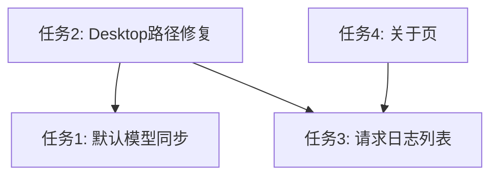

# Claude Switcher 任务规划

> 参考实现：`examples/cc-switch-main`（gitignore，本地只读参考）

---

## 任务 1：默认模型自动覆盖所有角色映射 

### 现状

- `ProviderForm.tsx` 有手动按钮 `fillAllRoles`，修改默认模型时角色映射不会自动同步。
- 后端 `ClaudeModelMapping.for_role()` 在角色为空时回退到默认模型，但保存到 DB / 写入配置时仍会保留旧的显式映射值。
- Claude Code（`claude_code.rs`）和 Claude Desktop（`claude_desktop.rs`）都依赖 `model_mapping` 字段。

### 目标

修改**默认模型**时，自动将所有可见角色映射字段覆盖为同一值：

- Claude Code：`sonnet / opus / haiku / fable / subagent`
- Claude Desktop：`sonnet / opus / haiku / fable`（无 subagent）

### 实现方案


| 层   | 文件                                | 改动                                                                        |
| --- | --------------------------------- | ------------------------------------------------------------------------- |
| 前端  | `src/components/ProviderForm.tsx` | 监听 `model` 字段变化；用户修改默认模型后自动 `setFieldValue("modelMapping", {...})` 覆盖全部角色 |
| 前端  | `src/i18n/locales/*.json`         | 可选：提示文案「修改默认模型将同步覆盖角色映射」                                                  |
| 后端  | `src-tauri/src/provider.rs`       | 可选：保存 provider 时若检测到 default model 变更，规范化 mapping（防御性，前端为主）               |


### 交互细节

- 仅在用户**主动修改**默认模型时触发（编辑已有 provider 初次加载不触发）。
- 用 `useRef` 记录上一次 model 值，跳过首次 `setFieldsValue`。
- 保留「一键填充」按钮作为显式操作入口（行为与自动同步一致）。


### 验收标准

- [ ] 新建 Claude Code provider：改默认模型 → 五个角色字段同步更新
- [ ] 新建 Claude Desktop provider：改默认模型 → 四个角色字段同步更新
- [ ] 保存后激活，Code `settings.json` 与 Desktop `configLibrary` profile 中各角色 env/label 均为新默认模型
- [ ] 编辑已有 provider 打开表单时不误覆盖已有映射

---


## 任务 2：修复 Claude Desktop 配置目录检测


### 现状与根因

当前 `src-tauri/src/config/claude_desktop.rs` 探测路径：

```
%LOCALAPPDATA%\Claude
%LOCALAPPDATA%\ClaudeZhCN
%APPDATA%\Claude
```

要求目录存在才返回路径；`configLibrary` 挂在探测到的 base 下。

**cc-switch 的实际逻辑**（`claude_desktop_config.rs`）：

- Windows 区分两个目录：
  - `Claude`（1p 官方）→ `claude_desktop_config.json`
  - `Claude-3p`（第三方）→ `configLibrary/` + `claude_desktop_config.json`
- `configLibrary` 在 `Claude-3p` 下，不在 `Claude` 下
- 支持模糊匹配：`Claude*`、`*-3p` 后缀
- 激活 provider 时写入 `deploymentMode: "3p"` 到两个 config 文件
- macOS：`~/Library/Application Support/Claude` + `Claude-3p`

用户报「未检测到配置目录」很可能因为本机只有 `Claude-3p` 而无 `Claude` / `ClaudeZhCN`。

### 实现方案


| 层   | 文件                                       | 改动                                                                                             |
| --- | ---------------------------------------- | ---------------------------------------------------------------------------------------------- |
| 后端  | `src-tauri/src/config/claude_desktop.rs` | 重构路径探测，对齐 cc-switch 的 `current_platform_paths` / `pick_windows_claude_dir` / `paths_from_dirs` |
| 后端  | 同上                                       | `apply_provider` 前 `create_dir_all(config_library)`；写入 `deploymentMode: "3p"`                  |
| 后端  | 同上                                       | `clear_provider` 恢复 `deploymentMode: "1p"`                                                     |
| 后端  | `src-tauri/src/commands/paths.rs`        | 扩展 `PathsInfo`：返回 normal / 3p 两套路径供环境页展示                                                       |
| 前端  | `src/pages/EnvironmentPage.tsx`          | 展示 Claude Desktop 1p/3p 路径，便于用户自查                                                              |
| 测试  | `claude_desktop.rs` tests                | 补充 Windows 路径选择、3p configLibrary 定位单元测试                                                        |


### 关键对齐点（来自 cc-switch）

```rust
// Windows
normal_dir  = LOCALAPPDATA/Claude      (或 Claude* 非 -3p)
threep_dir  = LOCALAPPDATA/Claude-3p   (或 Claude*-3p)
config_library = threep_dir/configLibrary
meta_path      = config_library/_meta.json
```


### 验收标准

- [ ] 仅安装 Claude Desktop（`Claude-3p` 目录）的机器可成功激活 provider
- [ ] 激活后 `_meta.json` 与 profile json 写入正确
- [ ] 环境页显示检测到的 Desktop 路径（含 3p）
- [ ] 恢复官方登录后 `deploymentMode` 回到 `1p`

---


## 任务 3：流量统计补充逐条请求记录


### 现状

- DB 表 `proxy_request_logs` 已存在，代理层 `insert_proxy_log` / `update_proxy_log_usage` 已在写入。
- `UsagePage` 仅展示汇总（请求数、趋势、按 provider/model 分组），**无逐条日志列表**。
- cc-switch 有完整实现：`get_request_logs` + `RequestLogTable` + `RequestDetailPanel`。


### 实现方案（精简版，匹配现有 schema）


#### 后端


| 文件                                         | 改动                                                                                 |
| ------------------------------------------ | ---------------------------------------------------------------------------------- |
| `src-tauri/src/database/dao/proxy_logs.rs` | 新增 `ProxyRequestLog` 结构体、`list_proxy_request_logs(conn, filters, page, page_size)` |
| `src-tauri/src/commands/usage.rs`          | 新增 Tauri command `list_proxy_request_logs`                                         |
| `src-tauri/src/commands/mod.rs`            | 注册 command                                                                         |
| `src/types/backend.ts`                     | 新增 `ProxyRequestLog`、`PaginatedProxyLogs`、`ProxyLogFilters` 类型                     |
| `src/services/api.ts`                      | 封装 `listProxyRequestLogs()`                                                        |


`ProxyRequestLog` **字段（对齐现有表，不扩 schema）：**
`id, createdAt, providerName, model, statusCode, inputTokens, outputTokens, durationMs, targetApp, protocol, route, isStream, errorCategory, diagnostic`

**筛选参数：**

- 时间范围（复用 UsagePage 的 days）
- `targetApp`（claude_code / claude_desktop）
- `statusCode`（可选）
- 分页：`page` + `pageSize`（默认 20）


#### 前端


| 文件                        | 改动                                    |
| ------------------------- | ------------------------------------- |
| `src/pages/UsagePage.tsx` | 在趋势图下方新增「请求记录」Card + Ant Design Table |
| `src/i18n/locales/*.json` | 新增列名、筛选、空状态文案                         |


**表格列建议：**
时间 | 应用 | 供应商 | 模型 | 状态码 | Token（入/出）| 耗时 | 流式

可选：点击行展开 `diagnostic` 详情（Drawer）。

### 验收标准

- [ ] 经本地代理的请求在列表中可见
- [ ] 分页、按天数筛选正常
- [ ] 流式请求在完成后显示 token 数
- [ ] 无代理直连的请求不出现在列表（与现有 description 一致）

---


## 任务 4：左侧导航新增「关于」页


### 现状

- 左侧导航最后一项是「环境」(`environment`)。
- 应用更新检查已在 `EnvironmentPage` 通过 `@tauri-apps/plugin-updater` 实现。
- 无独立「关于」入口；无 Claude Code 版本检查。


### 目标

1. 在左侧导航**最后**新增「关于」(`about`)
2. 显示应用版本号 + 检查更新（本应用）
3. 参考 cc-switch `AboutSection`，实现 **Claude Code 版本检查**（精简版，仅 claude 工具）


### 实现方案


#### 导航


| 文件                             | 改动                                                               |
| ------------------------------ | ---------------------------------------------------------------- |
| `src/components/AppLayout.tsx` | `NAV_ITEMS` 末尾加 `{ key: "about", icon: <InfoCircleOutlined /> }` |
| `src/App.tsx`                  | lazy load `AboutPage`，switch 加 `about` case                      |
| `src/i18n/locales/*.json`      | `nav.about`、`about.*` 文案                                         |


#### 关于页 UI（`src/pages/AboutPage.tsx`）

**区块 A — 本应用**

- 应用名 + 版本（`@tauri-apps/api` → `getVersion()`）
- 「检查更新」按钮 → 复用 `check()` from `@tauri-apps/plugin-updater`
- 有更新时 Modal 确认安装（逻辑从 `EnvironmentPage.checkForUpdates` 提取复用）

**区块 B — Claude Code**

- 当前版本：执行 `claude --version`（Rust 子进程）
- 最新版本：查询 npm registry `@anthropic-ai/claude-code` latest
- 状态徽章：已安装 / 未安装 / 有更新
- 「更新 Claude Code」按钮：执行 `npm i -g @anthropic-ai/claude-code@latest`（Windows 用 `cmd /C` 静默或弹终端，参考 cc-switch 简化）
- 显示一键安装命令（可复制）

**环境页调整**

- 从 `EnvironmentPage` 移除「检查更新」按钮（避免重复），或保留并注明「亦可在关于页操作」——推荐移除，关于页专责。


#### 后端（Claude Code 版本检查）


| 文件                                    | 改动                                                   |
| ------------------------------------- | ---------------------------------------------------- |
| `src-tauri/src/commands/tools.rs`（新建） | `get_claude_code_version`、`check_claude_code_update` |
| `src-tauri/src/commands/mod.rs`       | 注册 commands                                          |
| `src-tauri/Cargo.toml`                | 已有 `reqwest`，用于 npm registry 查询                      |


**精简实现**（不必移植 cc-switch 全套 6 工具 + WSL + 冲突诊断）：

```rust
// 本地：which claude + claude --version
// 远程：GET https://registry.npmjs.org/@anthropic-ai/claude-code/latest
// 返回 { installed, currentVersion, latestVersion, updateAvailable }
```

升级命令可选两种策略：

- **只读模式**：仅展示命令，用户自行复制执行（最安全，工作量最小）
- **执行模式**：`run_claude_code_update` command 后台跑 npm（参考 cc-switch `run_tool_lifecycle_action` 仅 claude 分支）

推荐先做**只读检测 + 复制命令**，升级执行作为二期。

### 验收标准

- [ ] 左侧最后一项为「关于」，可正常导航
- [ ] 显示本应用版本 v0.0.2
- [ ] 检查更新可检测 Tauri updater 渠道
- [ ] 显示 Claude Code 当前版本（已安装时）与 npm latest
- [ ] 有新版时明确提示；提供更新/安装命令

---


## 实施顺序与依赖




| 优先级 | 任务   | 理由                  |
| --- | ---- | ------------------- |
| P0  | 任务 2 | 阻塞 Desktop 配置，用户已报错 |
| P1  | 任务 1 | 小改动，改善配置体验          |
| P1  | 任务 3 | 补齐用量页核心功能           |
| P2  | 任务 4 | 新页面，可独立并行           |


**预估工作量：**

- 任务 1：~2h
- 任务 2：~4h（含测试）
- 任务 3：~4h
- 任务 4：~3h（精简版）

---


## 测试清单

```bash
# 编译
pnpm tauri build   # 或 pnpm tauri:dev 手动验证

# Rust 单元测试
cd src-tauri && cargo test claude_desktop
cd src-tauri && cargo test proxy_logs

# 手动验证
# 1. Desktop：激活 provider 不再报「未检测到配置目录」
# 2. 改默认模型 → 角色映射同步
# 3. 发几条代理请求 → 用量页列表可见
# 4. 关于页版本与更新检查
```

